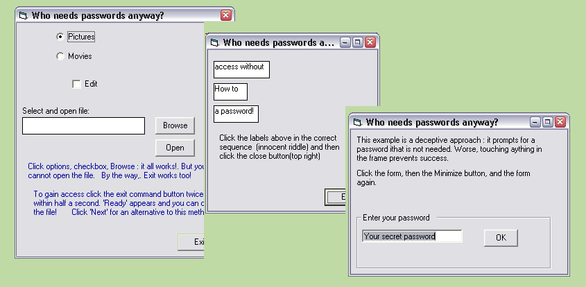



## NoPassword

### Description

There are other ways than passwords to restrict access to applications. The method I present here is suited for personal and limited public use. You'll see what I mean when you try out the basic method and two alternatives, all nicely packaged in a well commented appliction. But these are just examples. Use your creativity and create your own "protection"-scenario's.
 
### More Info
 

             |
---                |---
**Submitted On**   |2004-10-07 19:22:50
**By**             |[Paul Turcksin](https://github.com/Planet-Source-Code/PSCIndex/blob/master/ByAuthor/paul-turcksin.md)
**Level**          |Beginner
**User Rating**    |4.6 (32 globes from 7 users)
**Compatibility**  |VB 6\.0
**Category**       |[Miscellaneous](https://github.com/Planet-Source-Code/PSCIndex/blob/master/ByCategory/miscellaneous__1-1.md)
**World**          |[Visual Basic](https://github.com/Planet-Source-Code/PSCIndex/blob/master/ByWorld/visual-basic.md)
**Archive File**   |[NoPassword1802121072004\.zip](https://github.com/Planet-Source-Code/paul-turcksin-nopassword__1-56577/archive/master.zip)

